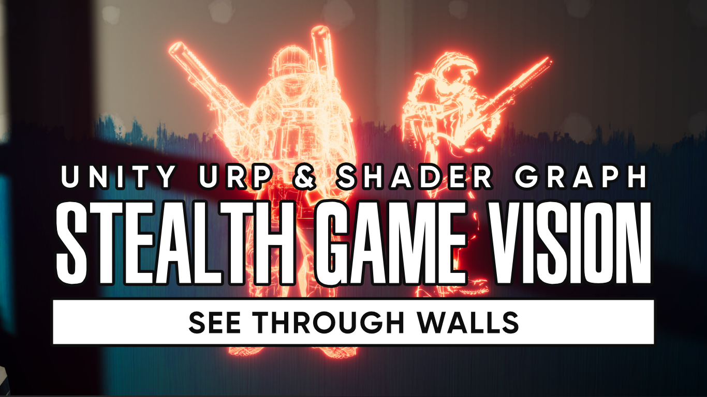

# Stealth Game Vision in Unity URP

A shader effect which allows you to see certain objects through walls.

## Overview

Many games, especially stealth games, give players the tools they need to see objects and entities through walls. In this project, I use URP Renderer Features and a glowing shader to make it possible to see through walls.

## Software

This project uses Unity 2020.3.21f1 and URP 10.6.0, but it should work with other versions.

## Tutorials

This project is part of a tutorial which is available in the following places:

- [https://www.youtube.com/watch?v=eLIe95csKWE](https://www.youtube.com/watch?v=eLIe95csKWE)

## Authors

This project and the corresponding tutorials were created by Daniel Ilett.

## Release

This project was released on January 31st 2022.
